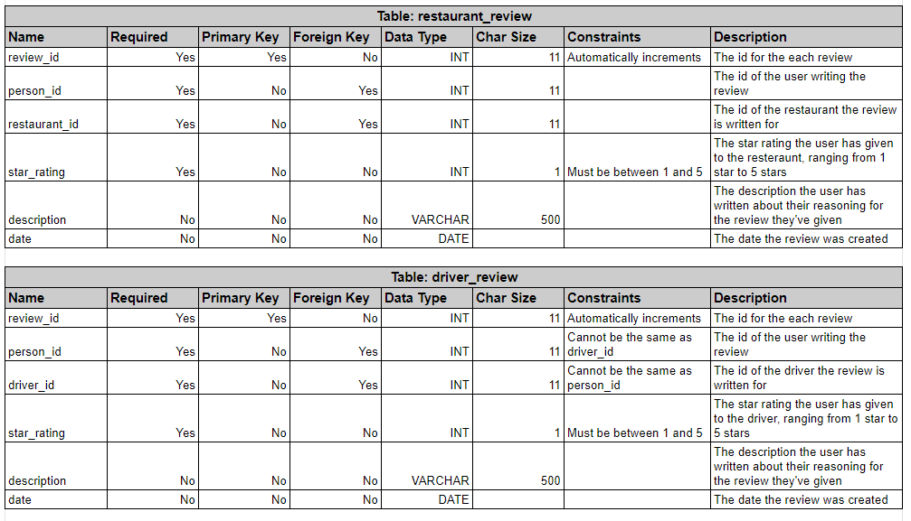
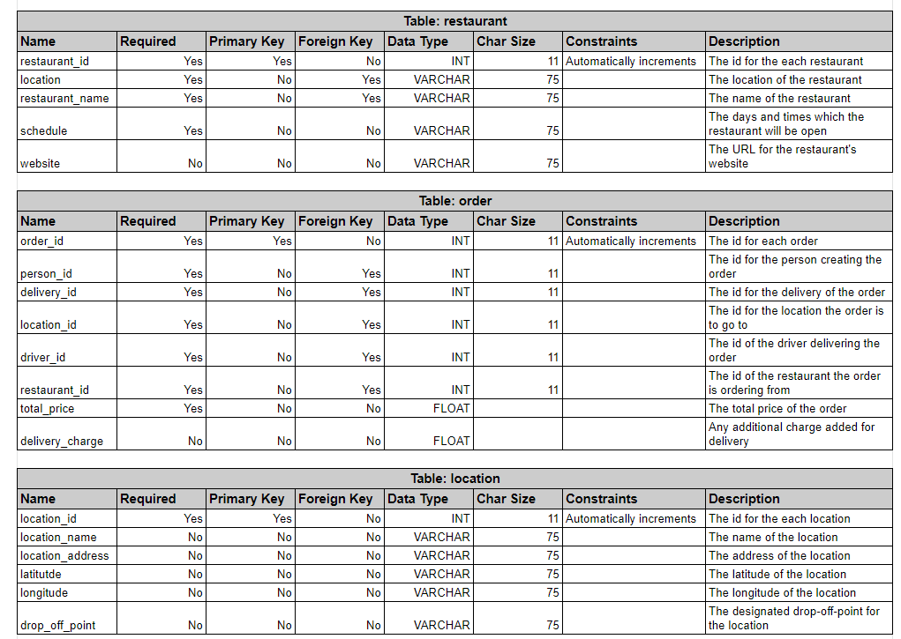
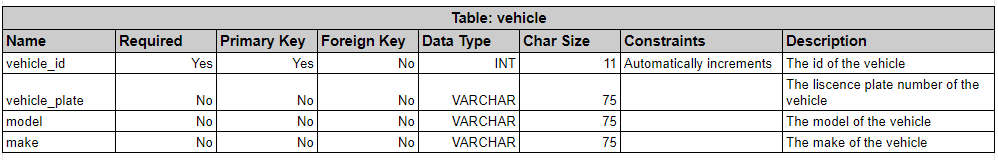
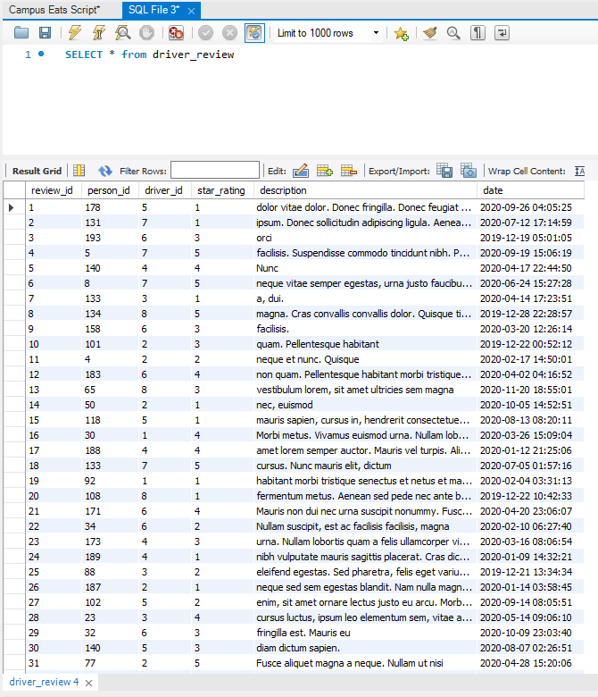
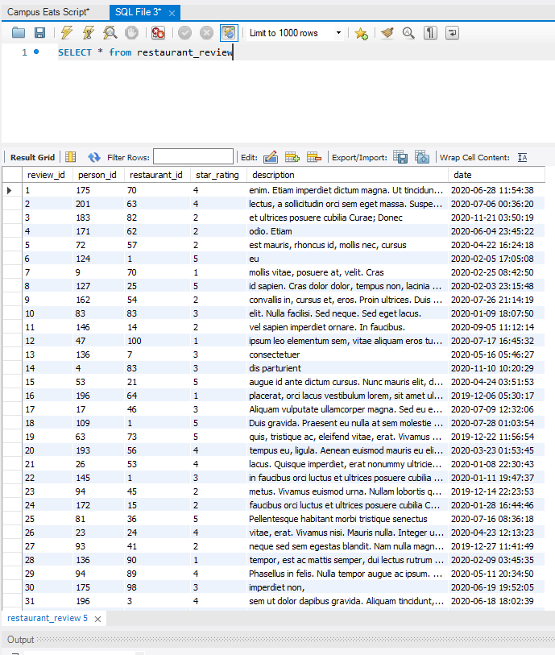

# This repository includes activities for ITCS 3160 - Database-Project-6.

## Index
* [Group members](#Group-members)
* [Introduction](#Introduction)
* [Use Case for Rating System](#Use-Case-for-Rating-System)
* [Business Rules](#Business-Rules)
* [EERD](#EERD)
* [MySQL Queries](#MySQL-Queries)
* [Stored Procedure](#Stored-Procedure)
* [Description of Future Work](#Description-of-Future-Work)
* [MySQL dump](#MySQL-dump)
* [PPT Video](#PPT-Video)

## Group members
    Sarah Chen,
    Truong Dang,
    Brian King,
    Yuanming Song,
    Aaron Ye
    
## Introduction
### The purpose of this project is to further work upon a database designed by a previous team in order to properly analyze and select data from said database. For the purposes of this project, members of an established group will examine given qualitative and quantitative information on a food delivery service company for UNCC and develop an adequate understanding of the structure of the database by assessing and working upon the provided EERD and SQL database. From the already existing EERD amongst other information provided, essential elements such as business rules, a use case diagram, a data dictionary, along with a normalized EERD must be designed. Group members must also implement a functional rating system for applicable entities within the relational database utilizing proper guidelines on normalization. To fulfill these requirements, appropriate knowledge of SQL must be demonstrated in order to complete specifics including procedure creation, query optimization, and complex query results.

## Use Case for Rating System
.jpg)

## Business Rules
* A valid credit/debit card must be available for order confirmation.
* All meals in a single order must be delivered to the same location. 
* All meals in a single order must be paid for using the same payment method.
* User must be at least 21 to order alcoholic beverages
* Minor(18 and under) are not allowed to place orders on this application
* No access from third parties allowed
* Application has the rights to revoke account if false information is detected
* A review must have a user writing it and a subject (driver or location) that is being reviewed
* A driver cannot review themself
* A driver and location can have many reviews written about them
* A review must only be between 1 and 5 stars inclusively
* A user can only review a driver or location once each

## EERD







## MySQL Queries
## Stored Procedure
# Driver Rating Procedure
```
CREATE PROCEDURE driverRating (IN driverID INT(11), OUT dRating float)
	SELECT AVG(`star_rating`)
    INTO dRating
    FROM `driver_review`
    WHERE driver_id=driverID;
```
# Restaurant Rating Procedure
```
CREATE PROCEDURE restaurantRating (IN restaurantID INT(11), OUT rRating float)
	SELECT AVG(`star_rating`)
    INTO rRating
    FROM `restaurant_review`
    WHERE restaurant_id=restaurantID;
```
## Web/App Implementation (Optional) or Description of Future Work
## MySQL dump
Entirety of test tables can be found in the "Campus Eats Script.sql" file.
```
DROP TABLE IF EXISTS `restaurant_review`;

CREATE TABLE `restaurant_review` (
  `review_id` int NOT NULL auto_increment,
  `person_id` int NOT NULL,
  `restaurant_id` int NOT NULL,
  `star_rating` int default NULL,
  `description` varchar(500) default NULL,
  `date` DATETIME,
  PRIMARY KEY (`review_id`),
  KEY fk_RR_person_id (person_id),
  KEY fk_RR_driver_id (restaurant_id),
  CONSTRAINT fk_RR_person_id FOREIGN KEY (person_id) REFERENCES person (person_id),
  CONSTRAINT fk_RR_driver_id FOREIGN KEY (restaurant_id) REFERENCES restaurant (restaurant_id)
) AUTO_INCREMENT=1;

INSERT INTO `restaurant_review` (`review_id`,`person_id`,`restaurant_id`,`star_rating`,`description`,`date`) VALUES (1,175,70,4,"enim. Etiam imperdiet dictum magna. Ut tincidunt orci quis lectus. Nullam","2020-06-28 11:54:38"),(2,201,63,4,"lectus, a sollicitudin orci sem eget massa. Suspendisse eleifend. Cras sed leo. Cras vehicula aliquet libero. Integer in magna. Phasellus","2020-07-06 00:36:20"),(3,183,82,2,"et ultrices posuere cubilia Curae; Donec","2020-11-21 03:50:19"),(4,171,62,2,"odio. Etiam","2020-06-04 23:45:22"),(5,72,57,2,"est mauris, rhoncus id, mollis nec, cursus","2020-04-22 16:24:18"),(6,124,1,5,"eu","2020-02-05 17:05:08"),(7,9,70,1,"mollis vitae, posuere at, velit. Cras","2020-02-25 08:42:50"),(8,127,25,5,"id sapien. Cras dolor dolor, tempus non, lacinia at, iaculis quis, pede. Praesent eu dui. Cum sociis natoque","2020-02-03 23:15:48"),(9,162,54,2,"convallis in, cursus et, eros. Proin ultrices. Duis volutpat nunc sit","2020-07-26 21:14:19"),(10,83,83,3,"elit. Nulla facilisi. Sed neque. Sed eget lacus.","2020-01-09 18:07:50");
INSERT INTO `restaurant_review` (`review_id`,`person_id`,`restaurant_id`,`star_rating`,`description`,`date`) VALUES (11,146,14,2,"vel sapien imperdiet ornare. In faucibus.","2020-09-05 11:12:14"),(12,47,100,1,"ipsum leo elementum sem, vitae aliquam eros turpis non enim. Mauris quis turpis vitae purus gravida sagittis. Duis","2020-07-17 16:45:32"),(13,136,7,3,"consectetuer","2020-05-16 05:46:27"),(14,4,83,3,"dis parturient","2020-11-10 10:20:29"),(15,53,21,5,"augue id ante dictum cursus. Nunc mauris elit, dictum eu, eleifend","2020-04-24 03:51:53"),(16,196,64,1,"placerat, orci lacus vestibulum lorem, sit amet ultricies sem magna nec","2019-12-06 05:30:17"),(17,17,46,3,"Aliquam vulputate ullamcorper magna. Sed eu eros. Nam consequat dolor vitae dolor. Donec fringilla. Donec feugiat metus","2020-07-09 12:32:06"),(18,109,1,5,"Duis gravida. Praesent eu nulla at sem molestie sodales. Mauris blandit enim consequat purus. Maecenas libero est,","2020-07-28 01:03:54"),(19,63,73,5,"quis, tristique ac, eleifend vitae, erat. Vivamus nisi. Mauris nulla. Integer urna. Vivamus","2019-12-22 11:56:54"),(20,193,56,4,"tempus eu, ligula. Aenean euismod mauris eu elit. Nulla facilisi. Sed neque.","2020-03-23 01:53:45");
INSERT INTO `restaurant_review` (`review_id`,`person_id`,`restaurant_id`,`star_rating`,`description`,`date`) VALUES (21,26,53,4,"lacus. Quisque imperdiet, erat nonummy ultricies ornare,","2020-01-08 22:30:43"),(22,145,1,3,"in faucibus orci luctus et ultrices posuere cubilia Curae; Phasellus ornare. Fusce mollis. Duis sit amet diam","2020-01-11 19:47:37"),(23,94,45,2,"metus. Vivamus euismod urna. Nullam lobortis quam a felis","2019-12-14 22:23:53"),(24,172,15,2,"faucibus orci luctus et ultrices posuere cubilia Curae; Donec tincidunt. Donec vitae erat vel pede blandit congue. In scelerisque scelerisque","2020-01-28 16:44:46"),(25,81,36,5,"Pellentesque habitant morbi tristique senectus","2020-07-16 08:36:18"),(26,23,24,4,"vitae, erat. Vivamus nisi. Mauris nulla. Integer urna. Vivamus","2020-04-23 12:13:23"),(27,93,41,2,"neque sed sem egestas blandit. Nam nulla magna, malesuada vel, convallis in, cursus et, eros. Proin","2019-12-27 11:41:49"),(28,136,90,1,"tempor, est ac mattis semper, dui lectus rutrum urna, nec luctus felis purus ac tellus. Suspendisse sed","2020-02-09 03:45:35"),(29,94,89,4,"Phasellus in felis. Nulla tempor augue ac ipsum. Phasellus vitae mauris sit amet","2020-05-11 20:34:50"),(30,175,98,3,"imperdiet non,","2020-06-19 19:52:05");
INSERT INTO `restaurant_review` (`review_id`,`person_id`,`restaurant_id`,`star_rating`,`description`,`date`) VALUES (31,196,3,4,"sem ut dolor dapibus gravida. Aliquam tincidunt, nunc","2020-06-18 18:02:39"),(32,3,36,5,"varius orci,","2020-06-29 06:32:56"),(33,96,84,2,"consectetuer, cursus et, magna. Praesent","2020-07-23 11:01:28"),(34,13,40,4,"penatibus et magnis dis parturient montes, nascetur ridiculus mus. Proin vel","2020-08-26 00:06:26"),(35,158,6,2,"lorem","2020-05-18 01:08:06"),(36,203,73,1,"in aliquet lobortis, nisi nibh lacinia orci, consectetuer euismod","2020-03-08 17:46:19"),(37,10,50,2,"ut","2019-12-28 12:47:01"),(38,104,66,4,"velit in aliquet lobortis, nisi nibh lacinia orci, consectetuer euismod est arcu ac orci. Ut","2020-10-15 15:40:54"),(39,51,48,2,"nec, eleifend non, dapibus rutrum, justo. Praesent luctus. Curabitur egestas nunc sed libero.","2020-05-12 16:26:17"),(40,36,78,4,"ullamcorper, nisl arcu iaculis enim, sit amet ornare lectus justo eu arcu. Morbi sit","2020-11-16 23:08:11");
INSERT INTO `restaurant_review` (`review_id`,`person_id`,`restaurant_id`,`star_rating`,`description`,`date`) VALUES (41,173,33,3,"egestas blandit. Nam","2020-04-04 07:30:20"),(42,163,44,1,"imperdiet dictum magna. Ut tincidunt orci quis","2020-06-30 03:44:10"),(43,104,79,2,"Sed diam lorem, auctor quis, tristique ac, eleifend vitae, erat. Vivamus nisi. Mauris nulla. Integer urna. Vivamus molestie dapibus ligula.","2020-10-27 15:02:06"),(44,81,83,3,"felis purus ac tellus. Suspendisse sed dolor. Fusce mi lorem, vehicula et, rutrum","2020-03-27 00:48:40"),(45,101,87,1,"malesuada fames ac turpis egestas. Aliquam fringilla cursus purus. Nullam scelerisque neque sed sem egestas blandit. Nam nulla","2020-01-15 05:33:41"),(46,91,5,1,"orci sem eget massa. Suspendisse eleifend. Cras sed leo. Cras vehicula aliquet libero. Integer in magna. Phasellus dolor elit,","2020-03-31 20:06:24"),(47,142,82,5,"vulputate dui, nec tempus mauris erat eget ipsum. Suspendisse sagittis. Nullam vitae diam. Proin dolor. Nulla semper tellus id","2020-10-16 17:33:32"),(48,95,61,1,"erat volutpat. Nulla facilisis. Suspendisse commodo tincidunt nibh. Phasellus nulla. Integer vulputate,","2020-07-22 02:10:52"),(49,189,82,1,"odio. Phasellus at augue id","2020-03-11 21:25:11"),(50,73,35,4,"malesuada. Integer id magna et ipsum","2020-07-03 21:57:21");
INSERT INTO `restaurant_review` (`review_id`,`person_id`,`restaurant_id`,`star_rating`,`description`,`date`) VALUES (51,54,18,1,"enim. Suspendisse aliquet, sem ut cursus luctus, ipsum leo","2020-06-20 15:34:54"),(52,61,26,4,"velit egestas lacinia. Sed congue, elit sed consequat","2020-04-25 18:46:17"),(53,22,31,5,"mollis non, cursus non, egestas a, dui. Cras pellentesque. Sed dictum. Proin eget odio.","2020-09-11 01:32:49"),(54,79,99,5,"ligula consectetuer rhoncus. Nullam velit dui,","2020-05-17 09:50:15"),(55,118,78,3,"natoque penatibus et magnis dis parturient montes, nascetur ridiculus mus. Proin vel arcu eu odio","2020-05-31 13:12:06"),(56,2,6,5,"diam nunc, ullamcorper eu, euismod ac, fermentum vel, mauris. Integer","2020-07-11 08:15:51"),(57,70,31,3,"consectetuer euismod est arcu ac orci. Ut semper pretium neque. Morbi","2020-07-27 16:47:30"),(58,168,47,4,"consectetuer adipiscing elit. Curabitur sed tortor. Integer aliquam adipiscing lacus. Ut nec urna et arcu imperdiet ullamcorper.","2020-08-14 18:56:14"),(59,161,11,3,"magna, malesuada vel, convallis","2020-04-13 17:43:05"),(60,27,48,2,"arcu. Aliquam ultrices","2020-02-23 10:52:58");
INSERT INTO `restaurant_review` (`review_id`,`person_id`,`restaurant_id`,`star_rating`,`description`,`date`) VALUES (61,141,44,1,"tempus eu, ligula. Aenean euismod mauris eu elit. Nulla facilisi. Sed neque. Sed eget lacus. Mauris","2020-08-19 01:27:47"),(62,85,21,5,"molestie tortor nibh sit amet orci. Ut sagittis lobortis mauris. Suspendisse aliquet molestie tellus. Aenean egestas hendrerit neque. In","2020-10-14 16:35:46"),(63,106,83,1,"Proin velit.","2020-05-07 00:17:20"),(64,150,63,1,"neque. Nullam nisl. Maecenas malesuada fringilla est. Mauris eu turpis. Nulla aliquet. Proin velit. Sed","2020-08-04 14:35:53"),(65,46,66,4,"odio. Nam interdum enim non","2020-03-14 11:13:49"),(66,160,25,1,"augue eu tellus. Phasellus elit pede, malesuada vel, venenatis vel, faucibus","2020-09-17 10:42:07"),(67,106,10,3,"lectus. Nullam suscipit, est ac facilisis facilisis, magna tellus faucibus leo, in lobortis tellus justo sit amet","2020-03-07 06:27:00"),(68,101,51,2,"adipiscing fringilla, porttitor vulputate, posuere vulputate, lacus. Cras interdum. Nunc sollicitudin commodo ipsum. Suspendisse non leo.","2020-04-16 06:28:48"),(69,169,71,2,"Nunc ut erat. Sed nunc","2020-11-08 23:34:24"),(70,19,68,3,"odio sagittis semper. Nam tempor diam dictum sapien. Aenean massa. Integer vitae nibh. Donec est mauris, rhoncus","2020-02-11 05:02:08");
INSERT INTO `restaurant_review` (`review_id`,`person_id`,`restaurant_id`,`star_rating`,`description`,`date`) VALUES (71,16,26,2,"Nullam enim. Sed nulla ante, iaculis nec, eleifend non, dapibus rutrum, justo. Praesent luctus. Curabitur egestas nunc sed libero.","2020-09-18 10:02:40"),(72,201,85,1,"dui,","2020-06-25 12:36:36"),(73,27,95,5,"quis diam. Pellentesque habitant morbi tristique senectus et netus","2019-12-06 14:17:52"),(74,183,95,4,"vitae odio","2020-04-28 18:33:19"),(75,103,33,3,"et magnis dis parturient montes, nascetur ridiculus mus. Aenean eget magna. Suspendisse tristique neque","2020-06-10 03:33:08"),(76,138,49,4,"malesuada ut, sem. Nulla interdum. Curabitur dictum. Phasellus in felis.","2020-09-10 14:04:11"),(77,111,7,5,"faucibus id, libero. Donec consectetuer mauris id sapien. Cras dolor dolor, tempus non, lacinia at, iaculis quis, pede. Praesent","2020-02-10 01:54:16"),(78,3,26,3,"vitae, orci. Phasellus dapibus quam quis diam. Pellentesque habitant morbi tristique senectus et netus et malesuada fames ac","2020-06-02 20:39:08"),(79,16,84,4,"Morbi sit amet massa. Quisque porttitor eros nec tellus. Nunc lectus pede, ultrices a, auctor non,","2020-04-15 13:58:42"),(80,38,93,3,"vulputate eu, odio. Phasellus at augue id ante dictum cursus.","2019-12-06 22:08:40");
INSERT INTO `restaurant_review` (`review_id`,`person_id`,`restaurant_id`,`star_rating`,`description`,`date`) VALUES (81,145,69,4,"nibh","2020-04-23 20:48:18"),(82,152,94,2,"morbi tristique","2020-02-11 00:38:04"),(83,191,40,2,"vel nisl. Quisque fringilla","2019-12-13 03:38:28"),(84,61,73,3,"Phasellus vitae mauris sit","2020-03-01 03:28:09"),(85,11,31,1,"aliquet vel, vulputate","2020-05-22 11:11:20"),(86,193,58,3,"ultrices posuere cubilia Curae; Donec tincidunt. Donec vitae erat vel pede blandit congue. In scelerisque scelerisque","2020-06-04 00:17:56"),(87,91,18,1,"non massa non ante bibendum ullamcorper. Duis cursus, diam at pretium aliquet, metus urna convallis erat, eget","2020-09-30 10:56:43"),(88,160,47,3,"ipsum cursus vestibulum. Mauris magna. Duis dignissim tempor","2020-10-06 02:16:56"),(89,59,33,5,"egestas nunc sed","2020-05-04 12:18:00"),(90,93,31,2,"ridiculus mus.","2019-12-25 17:00:13");
INSERT INTO `restaurant_review` (`review_id`,`person_id`,`restaurant_id`,`star_rating`,`description`,`date`) VALUES (91,162,41,2,"ligula. Aenean gravida nunc sed pede. Cum sociis natoque penatibus et magnis dis parturient montes,","2020-02-08 12:23:24"),(92,192,18,2,"ultricies ligula. Nullam enim. Sed nulla ante, iaculis nec, eleifend non, dapibus rutrum, justo. Praesent luctus. Curabitur egestas","2020-07-19 04:00:25"),(93,198,75,4,"ut eros non enim commodo hendrerit. Donec","2020-08-08 06:20:45"),(94,187,23,4,"tempor,","2020-09-03 18:13:10"),(95,41,8,1,"vulputate, nisi sem semper erat, in","2019-12-28 16:59:56"),(96,1,81,3,"libero lacus, varius et, euismod et, commodo at, libero. Morbi accumsan laoreet ipsum. Curabitur consequat, lectus sit amet luctus","2020-01-12 19:28:37"),(97,171,83,3,"congue.","2020-05-31 05:57:15"),(98,108,95,5,"ut eros non enim commodo hendrerit. Donec porttitor tellus non magna. Nam ligula","2020-04-09 10:34:05"),(99,127,82,5,"amet nulla. Donec non justo. Proin non massa non ante bibendum ullamcorper. Duis cursus,","2020-09-10 00:30:18"),(100,203,25,4,"dis parturient montes, nascetur ridiculus mus. Proin","2020-03-09 10:05:01");
```

```
DROP TABLE IF EXISTS `driver_review`;

CREATE TABLE `driver_review` (
  `review_id` int(11) NOT NULL auto_increment,
  `person_id` int(11) NOT NULL,
  `driver_id` int(11) NOT NULL,
  `star_rating` int default NULL,
  `description` varchar(500) default NULL,
  `date` DATETIME,
  PRIMARY KEY (`review_id`),
  KEY fk_DR_person_id (person_id),
  KEY fk_DR_driver_id (driver_id),
  CONSTRAINT fk_DR_person_id FOREIGN KEY (person_id) REFERENCES person (person_id),
  CONSTRAINT fk_DR_driver_id FOREIGN KEY (driver_id) REFERENCES driver (driver_id)
) ENGINE=InnoDB AUTO_INCREMENT=1;

INSERT INTO `driver_review` (`review_id`,`person_id`,`driver_id`,`star_rating`,`description`,`date`) VALUES (1,178,5,1,"dolor vitae dolor. Donec fringilla. Donec feugiat metus sit","2020-09-26 04:05:25"),(2,131,7,1,"ipsum. Donec sollicitudin adipiscing ligula. Aenean gravida nunc","2020-07-12 17:14:59"),(3,193,6,3,"orci","2019-12-19 05:01:05"),(4,5,7,5,"facilisis. Suspendisse commodo tincidunt nibh. Phasellus nulla. Integer vulputate, risus a ultricies adipiscing, enim mi tempor lorem, eget mollis","2020-09-19 15:06:19"),(5,140,4,4,"Nunc","2020-04-17 22:44:50"),(6,8,7,5,"neque vitae semper egestas, urna justo faucibus lectus, a sollicitudin orci sem eget massa. Suspendisse eleifend.","2020-06-24 15:27:28"),(7,133,3,1,"a, dui.","2020-04-14 17:23:51"),(8,134,8,5,"magna. Cras convallis convallis dolor. Quisque tincidunt pede","2019-12-28 22:28:57"),(9,158,6,3,"facilisis.","2020-03-20 12:26:14"),(10,101,2,3,"quam. Pellentesque habitant","2019-12-22 00:52:12");
INSERT INTO `driver_review` (`review_id`,`person_id`,`driver_id`,`star_rating`,`description`,`date`) VALUES (11,4,2,2,"neque et nunc. Quisque","2020-02-17 14:50:01"),(12,183,6,4,"non quam. Pellentesque habitant morbi tristique senectus et netus et malesuada fames ac turpis egestas.","2020-04-02 04:16:52"),(13,65,8,3,"vestibulum lorem, sit amet ultricies sem magna","2020-11-20 18:55:01"),(14,50,2,1,"nec, euismod","2020-10-05 14:52:51"),(15,118,5,1,"mauris sapien, cursus in, hendrerit consectetuer, cursus et, magna. Praesent interdum ligula eu enim. Etiam imperdiet","2020-08-13 08:20:11"),(16,30,1,4,"Morbi metus. Vivamus euismod urna. Nullam lobortis quam a felis ullamcorper viverra. Maecenas","2020-03-26 15:09:04"),(17,188,4,4,"amet lorem semper auctor. Mauris vel turpis. Aliquam adipiscing lobortis risus. In mi pede, nonummy ut, molestie in,","2020-01-12 21:25:06"),(18,133,7,5,"cursus. Nunc mauris elit, dictum","2020-07-05 01:57:16"),(19,92,1,1,"habitant morbi tristique senectus et netus et malesuada fames ac turpis egestas. Fusce aliquet magna a neque. Nullam ut nisi","2020-02-04 03:31:13"),(20,108,8,1,"fermentum metus. Aenean sed pede nec ante blandit viverra. Donec tempus, lorem fringilla ornare placerat, orci lacus vestibulum","2019-12-22 10:42:33");
INSERT INTO `driver_review` (`review_id`,`person_id`,`driver_id`,`star_rating`,`description`,`date`) VALUES (21,171,6,4,"Mauris non dui nec urna suscipit nonummy. Fusce fermentum fermentum arcu. Vestibulum ante ipsum primis","2020-04-20 23:06:07"),(22,34,6,2,"Nullam suscipit, est ac facilisis facilisis, magna","2020-02-10 06:27:40"),(23,173,4,3,"urna. Nullam lobortis quam a felis ullamcorper viverra. Maecenas iaculis aliquet diam. Sed diam lorem, auctor quis, tristique ac,","2020-03-16 08:06:54"),(24,189,4,1,"nibh vulputate mauris sagittis placerat. Cras dictum ultricies ligula. Nullam enim. Sed nulla ante, iaculis nec, eleifend non, dapibus rutrum,","2020-01-09 14:32:21"),(25,88,3,2,"eleifend egestas. Sed pharetra, felis eget varius ultrices, mauris ipsum porta elit, a","2019-12-21 13:34:34"),(26,187,2,1,"neque sed sem egestas blandit. Nam nulla magna, malesuada vel, convallis","2020-01-14 03:58:45"),(27,102,5,2,"enim, sit amet ornare lectus justo eu arcu. Morbi sit amet massa. Quisque porttitor eros nec","2020-09-14 08:05:51"),(28,23,3,4,"cursus luctus, ipsum leo elementum sem, vitae aliquam eros turpis non enim. Mauris quis turpis","2020-05-14 09:06:10"),(29,32,6,3,"fringilla est. Mauris eu","2020-10-09 23:03:40"),(30,140,5,3,"diam dictum sapien.","2020-08-07 02:26:51");
INSERT INTO `driver_review` (`review_id`,`person_id`,`driver_id`,`star_rating`,`description`,`date`) VALUES (31,77,2,5,"Fusce aliquet magna a neque. Nullam ut nisi","2020-04-28 15:20:06"),(32,103,6,2,"luctus. Curabitur egestas nunc sed libero. Proin","2020-09-24 06:19:46"),(33,92,8,3,"dis parturient montes, nascetur ridiculus","2020-02-19 10:31:45"),(34,32,2,1,"enim nec tempus scelerisque, lorem ipsum sodales purus, in molestie tortor nibh sit amet orci. Ut sagittis lobortis","2020-10-14 17:32:39"),(35,35,8,2,"tellus id nunc interdum","2020-05-07 00:25:15"),(36,23,1,1,"enim mi tempor lorem, eget mollis lectus pede et risus. Quisque libero lacus, varius et, euismod","2020-09-07 11:19:58"),(37,105,1,1,"montes, nascetur ridiculus mus. Aenean eget magna. Suspendisse tristique neque venenatis lacus. Etiam bibendum fermentum metus.","2020-06-21 12:21:50"),(38,46,5,4,"Phasellus vitae mauris sit amet lorem semper auctor. Mauris vel turpis.","2020-10-12 00:50:02"),(39,31,4,5,"est. Mauris eu turpis. Nulla aliquet. Proin","2020-06-30 00:23:29"),(40,51,8,5,"sed, facilisis vitae, orci. Phasellus dapibus quam quis diam. Pellentesque habitant morbi tristique senectus","2020-02-22 09:05:41");
INSERT INTO `driver_review` (`review_id`,`person_id`,`driver_id`,`star_rating`,`description`,`date`) VALUES (41,142,5,2,"Suspendisse sed dolor. Fusce mi lorem, vehicula et, rutrum eu, ultrices sit","2020-04-12 00:54:06"),(42,51,8,5,"ultricies dignissim lacus. Aliquam rutrum lorem ac risus. Morbi metus. Vivamus euismod urna.","2020-02-10 00:03:19"),(43,89,3,2,"dui quis accumsan convallis, ante lectus convallis est, vitae sodales nisi magna sed dui. Fusce aliquam, enim nec tempus scelerisque,","2020-08-02 01:09:08"),(44,145,6,2,"Duis sit amet diam eu dolor egestas rhoncus. Proin nisl sem, consequat nec, mollis","2020-11-03 08:37:40"),(45,197,5,1,"magna.","2020-11-04 01:56:34"),(46,125,5,5,"Morbi neque tellus, imperdiet non, vestibulum nec, euismod in, dolor. Fusce","2020-09-21 10:48:59"),(47,5,1,3,"nec ante","2020-02-09 15:14:22"),(48,125,4,5,"justo faucibus lectus, a sollicitudin orci sem eget massa. Suspendisse eleifend. Cras sed","2020-06-18 04:49:53"),(49,204,7,2,"ipsum leo elementum sem, vitae aliquam eros turpis non enim. Mauris","2020-05-20 10:31:51"),(50,99,2,4,"pede blandit congue. In scelerisque scelerisque dui. Suspendisse ac metus vitae velit egestas lacinia. Sed congue, elit","2020-05-05 13:14:07");
INSERT INTO `driver_review` (`review_id`,`person_id`,`driver_id`,`star_rating`,`description`,`date`) VALUES (51,33,5,4,"massa. Quisque porttitor eros nec tellus. Nunc lectus pede, ultrices a, auctor non, feugiat nec, diam. Duis mi enim,","2020-05-19 10:06:54"),(52,107,8,4,"consectetuer adipiscing elit. Curabitur sed tortor. Integer aliquam","2020-05-10 08:03:57"),(53,14,6,4,"nec urna et arcu imperdiet ullamcorper. Duis","2020-09-19 03:16:48"),(54,193,7,2,"Donec","2020-02-01 10:13:18"),(55,137,1,2,"felis. Donec tempor, est ac mattis semper, dui lectus rutrum urna, nec luctus felis","2020-02-21 02:28:08"),(56,201,7,5,"nonummy ac, feugiat non, lobortis quis, pede. Suspendisse dui. Fusce diam nunc,","2020-11-08 16:18:51"),(57,12,3,2,"Proin ultrices. Duis volutpat nunc sit amet","2020-05-15 15:42:24"),(58,135,8,3,"justo faucibus lectus, a sollicitudin orci sem eget massa. Suspendisse eleifend. Cras sed leo. Cras","2020-12-04 13:31:19"),(59,157,3,5,"In faucibus. Morbi vehicula.","2019-12-15 20:08:00"),(60,34,6,4,"netus","2020-04-11 12:26:09");
INSERT INTO `driver_review` (`review_id`,`person_id`,`driver_id`,`star_rating`,`description`,`date`) VALUES (61,71,6,4,"massa lobortis ultrices. Vivamus rhoncus. Donec est. Nunc ullamcorper,","2020-01-01 22:41:47"),(62,117,5,5,"dui lectus rutrum urna, nec luctus felis purus ac tellus. Suspendisse sed dolor. Fusce mi lorem, vehicula et,","2020-04-23 19:59:40"),(63,91,8,4,"feugiat. Lorem ipsum dolor sit amet, consectetuer adipiscing","2020-05-13 01:36:47"),(64,47,6,5,"ridiculus mus. Proin vel arcu eu odio tristique pharetra. Quisque ac libero nec ligula consectetuer","2020-07-30 19:32:09"),(65,55,7,4,"malesuada fames ac turpis egestas.","2020-11-16 11:27:39"),(66,124,1,5,"Aliquam erat volutpat. Nulla facilisis. Suspendisse commodo tincidunt nibh. Phasellus nulla. Integer vulputate, risus a ultricies adipiscing, enim","2020-04-13 02:51:26"),(67,29,3,5,"in","2020-07-09 01:31:04"),(68,99,8,5,"volutpat. Nulla facilisis. Suspendisse commodo tincidunt","2020-09-28 12:40:51"),(69,96,6,5,"nulla ante, iaculis nec, eleifend non, dapibus rutrum, justo.","2020-07-02 07:59:37"),(70,27,4,2,"Nulla tincidunt, neque vitae semper egestas, urna justo faucibus lectus, a sollicitudin orci sem eget massa. Suspendisse eleifend.","2019-12-30 07:44:02");
INSERT INTO `driver_review` (`review_id`,`person_id`,`driver_id`,`star_rating`,`description`,`date`) VALUES (71,26,7,1,"sem ut cursus luctus, ipsum leo elementum sem,","2020-09-10 21:45:13"),(72,126,7,2,"elit. Curabitur sed tortor. Integer","2020-08-20 04:44:11"),(73,48,6,2,"est, congue a, aliquet vel, vulputate eu, odio. Phasellus at augue id ante dictum","2020-02-29 09:54:02"),(74,22,3,5,"Sed dictum. Proin eget odio. Aliquam vulputate ullamcorper magna. Sed eu eros. Nam consequat dolor vitae dolor.","2020-09-02 14:36:18"),(75,9,8,4,"Quisque ac libero nec","2020-11-01 08:07:10"),(76,26,5,3,"dolor vitae dolor. Donec fringilla. Donec feugiat metus sit amet ante. Vivamus non lorem vitae odio sagittis semper. Nam","2020-04-04 09:10:04"),(77,160,2,2,"cursus a, enim. Suspendisse aliquet, sem ut cursus luctus, ipsum leo","2020-08-28 16:26:20"),(78,60,3,5,"justo. Proin non massa non ante bibendum ullamcorper. Duis","2020-03-03 04:24:55"),(79,34,1,5,"consectetuer rhoncus. Nullam velit dui, semper et, lacinia","2020-10-15 16:30:05"),(80,154,8,3,"ante dictum mi, ac mattis velit justo nec ante. Maecenas mi felis, adipiscing fringilla, porttitor vulputate, posuere vulputate,","2020-01-31 18:36:48");
INSERT INTO `driver_review` (`review_id`,`person_id`,`driver_id`,`star_rating`,`description`,`date`) VALUES (81,173,5,4,"Duis sit amet diam eu dolor egestas rhoncus. Proin nisl sem, consequat nec, mollis vitae,","2020-05-29 05:41:54"),(82,132,3,2,"metus eu erat semper rutrum. Fusce dolor quam,","2020-08-15 08:00:02"),(83,128,3,1,"sagittis semper. Nam tempor diam dictum sapien. Aenean massa. Integer vitae","2020-01-24 11:14:08"),(84,169,3,5,"nunc","2020-04-16 18:04:18"),(85,105,4,5,"Suspendisse non leo. Vivamus nibh dolor, nonummy ac, feugiat non, lobortis quis, pede.","2020-02-29 12:59:55"),(86,21,3,2,"a, aliquet vel, vulputate eu, odio. Phasellus at augue id","2020-03-10 05:07:14"),(87,120,4,1,"urna. Ut tincidunt vehicula risus. Nulla eget metus eu erat semper rutrum. Fusce dolor quam,","2020-05-19 17:14:58"),(88,165,5,1,"magna. Ut tincidunt orci quis lectus. Nullam suscipit, est ac facilisis facilisis, magna tellus faucibus leo, in lobortis","2020-10-01 16:39:49"),(89,63,7,3,"cubilia Curae; Phasellus ornare. Fusce mollis. Duis sit amet diam eu dolor egestas rhoncus. Proin","2020-11-23 00:47:06"),(90,160,5,2,"augue. Sed molestie. Sed id risus quis diam luctus lobortis. Class aptent taciti sociosqu ad litora torquent per","2020-06-21 05:11:55");
INSERT INTO `driver_review` (`review_id`,`person_id`,`driver_id`,`star_rating`,`description`,`date`) VALUES (91,72,7,3,"elit. Etiam laoreet, libero et tristique pellentesque, tellus sem mollis dui, in sodales elit erat","2020-11-12 12:26:12"),(92,17,5,2,"tempus mauris erat eget ipsum. Suspendisse","2020-06-28 11:48:03"),(93,125,2,1,"Vivamus non lorem vitae odio sagittis semper. Nam","2020-05-14 10:57:26"),(94,26,1,2,"scelerisque dui. Suspendisse ac metus vitae velit egestas","2020-10-07 08:25:38"),(95,128,8,2,"tempor bibendum. Donec felis orci, adipiscing non, luctus sit amet, faucibus","2020-10-22 05:54:44"),(96,154,5,4,"metus. In lorem. Donec elementum, lorem","2020-11-20 04:56:11"),(97,203,8,4,"pede. Suspendisse dui. Fusce diam","2020-05-14 17:09:09"),(98,57,5,2,"neque venenatis lacus. Etiam bibendum","2020-02-24 21:07:07"),(99,3,2,1,"Nam porttitor scelerisque neque. Nullam nisl. Maecenas malesuada fringilla est. Mauris eu turpis. Nulla aliquet. Proin velit. Sed malesuada augue","2020-01-26 14:40:40"),(100,136,5,5,"faucibus leo, in lobortis tellus justo sit amet nulla. Donec non justo.","2020-02-22 10:58:58");
```

## PPT Video
DEMONSTRATION OF PROJECT via short (6 min or less) Video - upload to YouTube, post link in Github
