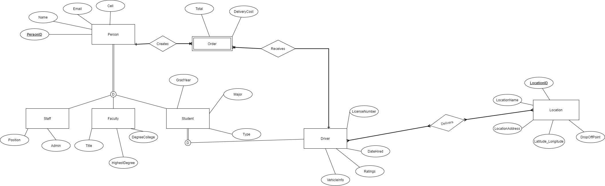

# This repository includes activities for ITCS 3160 - Database-Project-6.

## Group members:
    Sarah Chen,
    Truong Dang,
    Brian King,
    Yuanming Song,
    Aaron Ye
    
## introduction： 
### The purpose of this project is to further work upon a database designed by a previous team in order to properly analyze and select data from said database. For the purposes of this project, members of an established group will examine given qualitative and quantitative information on a food delivery service company for UNCC and develop an adequate understanding of the structure of the database by assessing and working upon the provided EERD and SQL database. From the already existing EERD amongst other information provided, essential elements such as business rules, a use case diagram, a data dictionary, along with a normalized EERD must be designed. Group members must also implement a functional rating system for applicable entities within the relational database utilizing proper guidelines on normalization. To fulfil these requirements, appropriate knowledge of SQL must be demonstrated in order to complete specifics including procedure creation, query optimization, and complex query results.

## **Use Case for Rating System**
Business Rules
EERD (full database)
MySQL Queries
Stored Procedure
Web/App Implementation (Optional) or Description of Future Work
MySQL dump
PPT Video (link)
