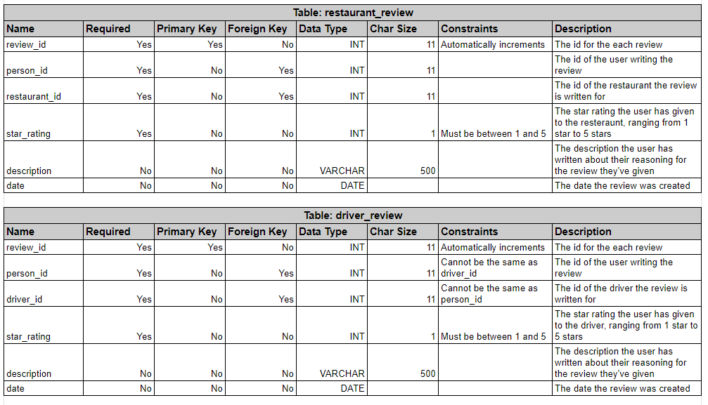

# This repository includes activities for ITCS 3160 - Database-Project-6.

## Index
* [Group members](#Group-members)
* [Introduction](#Introduction)
* [Use Case for Rating System](#Use-Case-for-Rating-System)
* [Business Rules](#Business-Rules)
* [EERD](#EERD)
* [MySQL Queries](#MySQL-Queries)
* [Stored Procedure](#Stored-Procedure)
* [Description of Future Work](#Description-of-Future-Work)
* [MySQL dump](#MySQL-dump)
* [PPT Video](#PPT-Video)

## Group members
    Sarah Chen,
    Truong Dang,
    Brian King,
    Yuanming Song,
    Aaron Ye
    
## Introduction
### The purpose of this project is to further work upon a database designed by a previous team in order to properly analyze and select data from said database. For the purposes of this project, members of an established group will examine given qualitative and quantitative information on a food delivery service company for UNCC and develop an adequate understanding of the structure of the database by assessing and working upon the provided EERD and SQL database. From the already existing EERD amongst other information provided, essential elements such as business rules, a use case diagram, a data dictionary, along with a normalized EERD must be designed. Group members must also implement a functional rating system for applicable entities within the relational database utilizing proper guidelines on normalization. To fulfill these requirements, appropriate knowledge of SQL must be demonstrated in order to complete specifics including procedure creation, query optimization, and complex query results.

## <span style="color:blue">Use Case for Rating System</span>
.jpg)

## <span style="color:blue">Business Rules</span>
* A valid credit/debit card must be available for order confirmation.
* All meals in a single order must be delivered to the same location. 
* All meals in a single order must be paid for using the same payment method.
* User must be at least 21 to order alcoholic beverages
* Minor(18 and under) are not allowed to place orders on this application
* No access from third parties allowed
* Application has the rights to revoke account if false information is detected
* A review must have a user writing it and a subject (driver or location) that is being reviewed
* A driver cannot review themself
* A driver and location can have many reviews written about them
* A review must only be between 1 and 5 stars inclusively
* A user can only review a driver or location once each

## <span style="color:blue">EERD</span>




## MySQL Queries
## Stored Procedure
## Web/App Implementation (Optional) or Description of Future Work
## MySQL dump
```
DROP TABLE `restaurant_review`;

CREATE TABLE `restaurant_review` (
  `id` mediumint(8) unsigned NOT NULL auto_increment,
  `review_id` int,
  `person_id` int,
  `restaurant_id` int,
  `star_rating` int default NULL,
  `description` TEXT default NULL,
  `date` varchar(255),
  PRIMARY KEY (`id`)
) AUTO_INCREMENT=1;

INSERT INTO `restaurant_review` (`review_id`,`person_id`,`restaurant_id`,`star_rating`,`description`,`date`) VALUES (1,100,1000,4,"lectus, a sollicitudin orci","29092021"),(2,101,1001,5,"auctor odio a purus. Duis elementum,","17012021"),(3,102,1002,3,"sociis natoque penatibus","20092021"),(4,103,1003,1,"tempor bibendum. Donec felis orci, adipiscing non,","19052020"),(5,104,1004,5,"eu, odio. Phasellus at","19082021"),(6,105,1005,1,"Vivamus molestie dapibus ligula.","31102021"),(7,106,1006,2,"In","04042021"),(8,107,1007,2,"arcu. Aliquam ultrices iaculis odio. Nam interdum enim non nisi.","21112020"),(9,108,1008,1,"nec","29042021"),(10,109,1009,5,"tempor,","08062020");
INSERT INTO `restaurant_review` (`review_id`,`person_id`,`restaurant_id`,`star_rating`,`description`,`date`) VALUES (11,110,1010,2,"quis diam. Pellentesque habitant morbi tristique senectus","21062020"),(12,111,1011,2,"non, vestibulum","17062020"),(13,112,1012,4,"ligula consectetuer rhoncus. Nullam velit dui, semper","05012020"),(14,113,1013,5,"Mauris vestibulum, neque","24042021"),(15,114,1014,2,"In at pede.","18062020"),(16,115,1015,2,"aliquet, sem ut cursus luctus, ipsum leo elementum sem,","13082021"),(17,116,1016,5,"purus","03042021"),(18,117,1017,1,"in felis. Nulla tempor","27012021"),(19,118,1018,2,"dapibus rutrum, justo. Praesent luctus. Curabitur egestas nunc sed","01082021"),(20,119,1019,4,"semper auctor. Mauris vel turpis. Aliquam","09012020");
INSERT INTO `restaurant_review` (`review_id`,`person_id`,`restaurant_id`,`star_rating`,`description`,`date`) VALUES (21,120,1020,5,"Vivamus molestie dapibus ligula.","03092021"),(22,121,1021,5,"In mi pede,","11032021"),(23,122,1022,2,"consectetuer mauris id sapien.","11012021"),(24,123,1023,1,"pede. Nunc sed orci lobortis augue scelerisque","30042020"),(25,124,1024,1,"semper","22092020"),(26,125,1025,5,"nisi dictum augue malesuada malesuada.","21092020"),(27,126,1026,2,"viverra. Donec tempus, lorem fringilla ornare placerat, orci lacus","20062020"),(28,127,1027,1,"tincidunt adipiscing. Mauris molestie pharetra nibh. Aliquam ornare,","30062020"),(29,128,1028,1,"dolor, nonummy ac, feugiat non, lobortis","29092020"),(30,129,1029,3,"turpis. Aliquam adipiscing lobortis risus. In mi pede, nonummy","31082021");
INSERT INTO `restaurant_review` (`review_id`,`person_id`,`restaurant_id`,`star_rating`,`description`,`date`) VALUES (31,130,1030,3,"orci","10112021"),(32,131,1031,5,"et, rutrum non, hendrerit id, ante. Nunc mauris sapien,","06092020"),(33,132,1032,2,"Morbi non sapien molestie orci tincidunt adipiscing.","27022020"),(34,133,1033,3,"Nullam velit dui, semper et,","25072020"),(35,134,1034,4,"ultrices iaculis odio. Nam interdum enim","05062020"),(36,135,1035,3,"nibh dolor, nonummy ac, feugiat non,","24012021"),(37,136,1036,1,"tellus faucibus leo, in lobortis tellus","25092021"),(38,137,1037,5,"euismod ac, fermentum vel, mauris. Integer sem elit, pharetra ut,","05042021"),(39,138,1038,4,"dignissim magna a tortor. Nunc commodo auctor velit. Aliquam nisl.","23052020"),(40,139,1039,5,"sociosqu ad","08102021");
INSERT INTO `restaurant_review` (`review_id`,`person_id`,`restaurant_id`,`star_rating`,`description`,`date`) VALUES (41,140,1040,5,"dapibus","02082020"),(42,141,1041,3,"urna. Vivamus","16062021"),(43,142,1042,3,"orci. Phasellus dapibus quam quis diam. Pellentesque habitant","02052020"),(44,143,1043,3,"lorem.","26102021"),(45,144,1044,3,"turpis egestas. Fusce aliquet","23072020"),(46,145,1045,3,"neque non quam. Pellentesque","16062021"),(47,146,1046,4,"nec enim. Nunc","02092020"),(48,147,1047,5,"Integer tincidunt aliquam","05112021"),(49,148,1048,2,"tempor erat neque non quam. Pellentesque habitant morbi tristique","28092021"),(50,149,1049,4,"molestie orci tincidunt adipiscing. Mauris molestie pharetra nibh. Aliquam ornare,","22022021");
INSERT INTO `restaurant_review` (`review_id`,`person_id`,`restaurant_id`,`star_rating`,`description`,`date`) VALUES (51,150,1050,2,"dis parturient","26022020"),(52,151,1051,3,"id, erat. Etiam vestibulum massa rutrum magna.","25062020"),(53,152,1052,3,"est,","10092020"),(54,153,1053,4,"pede, ultrices a, auctor","01052021"),(55,154,1054,1,"justo. Proin","12122020"),(56,155,1055,5,"sagittis semper. Nam tempor diam dictum","19042021"),(57,156,1056,3,"cursus in, hendrerit","24102021"),(58,157,1057,2,"tellus. Nunc lectus","19012020"),(59,158,1058,3,"sodales purus, in molestie tortor nibh sit amet orci. Ut","05012020"),(60,159,1059,5,"porta elit,","21022020");
INSERT INTO `restaurant_review` (`review_id`,`person_id`,`restaurant_id`,`star_rating`,`description`,`date`) VALUES (61,160,1060,2,"non, lobortis","15032020"),(62,161,1061,4,"magna. Ut tincidunt orci quis lectus.","20082020"),(63,162,1062,1,"aliquet libero. Integer in magna. Phasellus dolor elit,","15032021"),(64,163,1063,3,"dui. Fusce diam nunc, ullamcorper eu, euismod ac, fermentum","24082020"),(65,164,1064,2,"Sed malesuada","23012021"),(66,165,1065,3,"non","10102020"),(67,166,1066,3,"tristique ac, eleifend vitae, erat.","04102021"),(68,167,1067,1,"et arcu imperdiet ullamcorper. Duis at","05012021"),(69,168,1068,3,"sit amet ornare lectus justo eu arcu. Morbi sit amet","24012021"),(70,169,1069,1,"Maecenas libero est, congue a, aliquet","22062020");
INSERT INTO `restaurant_review` (`review_id`,`person_id`,`restaurant_id`,`star_rating`,`description`,`date`) VALUES (71,170,1070,4,"amet","14092021"),(72,171,1071,3,"sem egestas blandit. Nam nulla magna, malesuada","01112020"),(73,172,1072,1,"lorem semper auctor. Mauris vel turpis. Aliquam adipiscing","06042021"),(74,173,1073,1,"ut,","07112020"),(75,174,1074,3,"mauris ipsum porta elit, a","04032021"),(76,175,1075,1,"dictum eleifend, nunc risus varius","30112020"),(77,176,1076,1,"mauris, aliquam eu, accumsan","26102021"),(78,177,1077,1,"augue porttitor interdum. Sed auctor odio a purus.","04092021"),(79,178,1078,4,"in sodales elit erat","15122019"),(80,179,1079,4,"Nam tempor diam dictum","16092020");
INSERT INTO `restaurant_review` (`review_id`,`person_id`,`restaurant_id`,`star_rating`,`description`,`date`) VALUES (81,180,1080,4,"et risus. Quisque libero lacus, varius et, euismod et, commodo","16062020"),(82,181,1081,3,"Phasellus in felis. Nulla tempor","24092021"),(83,182,1082,5,"vitae odio sagittis semper. Nam tempor","05102021"),(84,183,1083,1,"iaculis, lacus pede sagittis augue, eu tempor erat neque non","19052021"),(85,184,1084,4,"neque sed sem egestas blandit.","02102020"),(86,185,1085,4,"enim. Nunc ut","07012021"),(87,186,1086,3,"pede ac urna. Ut tincidunt vehicula risus.","12012020"),(88,187,1087,1,"nisl elementum purus,","20072020"),(89,188,1088,4,"Nunc pulvinar arcu","07032020"),(90,189,1089,2,"laoreet, libero","12012021");
INSERT INTO `restaurant_review` (`review_id`,`person_id`,`restaurant_id`,`star_rating`,`description`,`date`) VALUES (91,190,1090,2,"nibh enim, gravida sit amet,","07012021"),(92,191,1091,4,"sociis","13052020"),(93,192,1092,5,"aliquam adipiscing lacus. Ut nec","27032020"),(94,193,1093,5,"auctor non, feugiat nec, diam. Duis","13082020"),(95,194,1094,3,"elit, dictum eu, eleifend nec, malesuada ut, sem.","04022021"),(96,195,1095,4,"dolor sit","01022021"),(97,196,1096,3,"Integer in magna. Phasellus dolor elit, pellentesque a,","18102021"),(98,197,1097,4,"aliquet. Proin velit. Sed malesuada augue ut","12072020"),(99,198,1098,4,"congue. In scelerisque","14072020"),(100,199,1099,3,"sagittis semper. Nam tempor diam dictum sapien. Aenean massa. Integer","16112020");
```
```
DROP TABLE `driver_review`;

CREATE TABLE `driver_review` (
  `id` mediumint(8) unsigned NOT NULL auto_increment,
  `review_id` int,
  `person_id` int,
  `driver_id` int default NULL,
  `star_rating` int default NULL,
  `description` TEXT default NULL,
  `date` varchar(255),
  PRIMARY KEY (`id`)
) AUTO_INCREMENT=1;

INSERT INTO `driver_review` (`review_id`,`person_id`,`driver_id`,`star_rating`,`description`,`date`) VALUES (1,100,3,2,"lacus, varius et, euismod et, commodo at, libero. Morbi accumsan","15102021"),(2,101,4,3,"in consequat enim diam","28052020"),(3,102,8,1,"odio a purus. Duis elementum, dui quis accumsan","21022021"),(4,103,5,5,"urna suscipit nonummy. Fusce fermentum fermentum arcu. Vestibulum ante ipsum","30082021"),(5,104,8,4,"neque.","13092020"),(6,105,7,3,"gravida nunc sed","30112021"),(7,106,7,1,"Sed eu eros.","24102021"),(8,107,6,3,"a, magna.","26112020"),(9,108,1,3,"parturient montes, nascetur ridiculus mus.","04052020"),(10,109,3,1,"augue porttitor interdum. Sed auctor odio a purus. Duis","18062021");
INSERT INTO `driver_review` (`review_id`,`person_id`,`driver_id`,`star_rating`,`description`,`date`) VALUES (11,110,5,3,"mauris. Suspendisse aliquet molestie tellus. Aenean egestas hendrerit neque. In","08112021"),(12,111,8,2,"lobortis augue scelerisque mollis. Phasellus libero","25052020"),(13,112,8,5,"rutrum","18122020"),(14,113,8,2,"enim. Etiam gravida","10072020"),(15,114,6,3,"a odio semper cursus. Integer mollis.","29072021"),(16,115,3,2,"iaculis, lacus","29112020"),(17,116,3,3,"Aliquam auctor, velit","29112020"),(18,117,8,1,"adipiscing fringilla, porttitor vulputate, posuere vulputate, lacus. Cras interdum.","13102020"),(19,118,8,1,"mus.","12052021"),(20,119,2,5,"ac facilisis facilisis, magna tellus faucibus","12042020");
INSERT INTO `driver_review` (`review_id`,`person_id`,`driver_id`,`star_rating`,`description`,`date`) VALUES (21,120,2,3,"risus. Nulla eget metus eu erat semper rutrum. Fusce dolor","09112021"),(22,121,4,4,"ac mattis ornare, lectus","16062021"),(23,122,4,3,"auctor non,","22042020"),(24,123,4,3,"parturient montes, nascetur ridiculus mus. Proin","22032020"),(25,124,8,2,"Proin ultrices. Duis volutpat nunc sit amet metus. Aliquam erat","23042020"),(26,125,1,3,"nulla magna, malesuada vel, convallis","09042021"),(27,126,5,1,"lorem fringilla ornare placerat, orci lacus vestibulum lorem, sit","23022021"),(28,127,6,3,"malesuada. Integer","05072021"),(29,128,8,5,"nibh vulputate","03102021"),(30,129,6,4,"eros. Nam consequat dolor","13112021");
INSERT INTO `driver_review` (`review_id`,`person_id`,`driver_id`,`star_rating`,`description`,`date`) VALUES (31,130,7,5,"mattis. Cras eget nisi dictum augue malesuada malesuada.","03042021"),(32,131,2,3,"semper tellus id nunc interdum feugiat. Sed nec","18052020"),(33,132,4,2,"nunc ac mattis ornare, lectus ante dictum","21092020"),(34,133,4,2,"amet ante. Vivamus non lorem vitae odio sagittis semper.","27072021"),(35,134,1,4,"neque. In ornare sagittis felis. Donec tempor, est","02082021"),(36,135,3,4,"ac mi eleifend egestas. Sed pharetra, felis eget","09122020"),(37,136,7,3,"Duis a mi fringilla mi","23052021"),(38,137,8,2,"nibh. Quisque nonummy ipsum non arcu. Vivamus sit amet","18062021"),(39,138,2,5,"luctus,","20012020"),(40,139,2,3,"rutrum. Fusce dolor quam,","06102021");
INSERT INTO `driver_review` (`review_id`,`person_id`,`driver_id`,`star_rating`,`description`,`date`) VALUES (41,140,5,3,"aliquam eu, accumsan sed, facilisis vitae, orci. Phasellus dapibus","30082021"),(42,141,5,4,"massa. Quisque porttitor eros nec","21052021"),(43,142,8,4,"lectus","26042021"),(44,143,5,5,"risus","26082021"),(45,144,6,3,"Nullam lobortis quam a felis ullamcorper viverra. Maecenas","25052021"),(46,145,5,2,"quam vel sapien","02122020"),(47,146,4,2,"leo. Vivamus nibh dolor, nonummy ac,","09062021"),(48,147,6,2,"ligula. Aenean euismod mauris eu","15122019"),(49,148,5,3,"ornare, elit elit","18032020"),(50,149,2,1,"eu, placerat eget, venenatis a, magna. Lorem ipsum","30042020");
INSERT INTO `driver_review` (`review_id`,`person_id`,`driver_id`,`star_rating`,`description`,`date`) VALUES (51,150,2,5,"mauris sit amet","05042021"),(52,151,4,5,"lorem, sit amet ultricies sem magna nec quam. Curabitur vel","25032021"),(53,152,3,3,"vel lectus. Cum sociis natoque penatibus et magnis dis","04042021"),(54,153,6,1,"tristique aliquet. Phasellus fermentum convallis ligula. Donec luctus","11032021"),(55,154,4,3,"enim. Nunc ut erat. Sed nunc","02122020"),(56,155,8,5,"dolor sit amet, consectetuer adipiscing elit. Curabitur sed tortor.","18102021"),(57,156,5,5,"velit egestas lacinia. Sed congue, elit","12122019"),(58,157,3,4,"eros","24122020"),(59,158,3,4,"Etiam","20032020"),(60,159,5,2,"cursus. Integer mollis. Integer tincidunt aliquam arcu. Aliquam ultrices iaculis","01042020");
INSERT INTO `driver_review` (`review_id`,`person_id`,`driver_id`,`star_rating`,`description`,`date`) VALUES (61,160,3,5,"metus facilisis lorem","19062021"),(62,161,8,5,"blandit mattis. Cras","26112021"),(63,162,7,5,"nibh sit amet orci. Ut sagittis lobortis mauris.","03112020"),(64,163,8,1,"eu metus. In lorem. Donec elementum, lorem ut aliquam","21022020"),(65,164,3,3,"morbi","12072020"),(66,165,2,2,"fermentum risus, at fringilla purus mauris a nunc.","14092021"),(67,166,3,3,"turpis","09062020"),(68,167,5,2,"Vivamus nibh","08082021"),(69,168,4,3,"Proin nisl sem, consequat nec, mollis vitae, posuere","10022020"),(70,169,3,1,"litora","29062021");
INSERT INTO `driver_review` (`review_id`,`person_id`,`driver_id`,`star_rating`,`description`,`date`) VALUES (71,170,3,4,"lectus justo eu arcu. Morbi sit amet massa. Quisque porttitor","10022021"),(72,171,2,3,"sapien. Aenean massa. Integer vitae nibh.","19092021"),(73,172,6,1,"Phasellus fermentum convallis","13022021"),(74,173,8,5,"vestibulum lorem, sit amet ultricies sem magna nec quam.","03092020"),(75,174,1,2,"lobortis quam a felis ullamcorper viverra.","10082021"),(76,175,2,4,"Praesent luctus. Curabitur egestas nunc","29092020"),(77,176,1,1,"vel quam dignissim pharetra. Nam ac","25032020"),(78,177,5,2,"blandit mattis. Cras eget nisi dictum augue malesuada","26122019"),(79,178,6,3,"dolor sit amet, consectetuer adipiscing elit. Aliquam auctor,","21052020"),(80,179,2,2,"et, commodo at, libero. Morbi accumsan laoreet ipsum. Curabitur consequat,","05112020");
INSERT INTO `driver_review` (`review_id`,`person_id`,`driver_id`,`star_rating`,`description`,`date`) VALUES (81,180,2,5,"vel est tempor bibendum. Donec","22042020"),(82,181,1,5,"sed pede. Cum sociis natoque penatibus","24102020"),(83,182,6,1,"Mauris blandit enim consequat purus. Maecenas libero est, congue a,","21072021"),(84,183,1,3,"egestas,","15062020"),(85,184,2,3,"luctus","17022021"),(86,185,8,4,"ligula. Aenean gravida","06052021"),(87,186,3,3,"nunc sed pede. Cum sociis natoque penatibus et","23112020"),(88,187,1,4,"facilisis. Suspendisse commodo tincidunt nibh.","10012021"),(89,188,3,4,"enim non","20052021"),(90,189,7,1,"adipiscing fringilla, porttitor vulputate, posuere vulputate, lacus.","22022020");
INSERT INTO `driver_review` (`review_id`,`person_id`,`driver_id`,`star_rating`,`description`,`date`) VALUES (91,190,3,3,"pellentesque. Sed","07122020"),(92,191,4,2,"natoque penatibus et magnis dis parturient montes, nascetur ridiculus","25092021"),(93,192,6,3,"Suspendisse dui.","26112021"),(94,193,5,3,"rhoncus. Proin","14062021"),(95,194,8,4,"facilisis lorem tristique aliquet. Phasellus fermentum convallis ligula.","16122019"),(96,195,2,3,"purus, in molestie","10092021"),(97,196,1,2,"non, feugiat nec, diam. Duis mi","14102021"),(98,197,2,2,"adipiscing lacus.","11032021"),(99,198,2,1,"primis in faucibus orci luctus","27052020"),(100,199,4,1,"diam vel arcu. Curabitur ut odio vel est tempor","27082021");
```
## PPT Video
