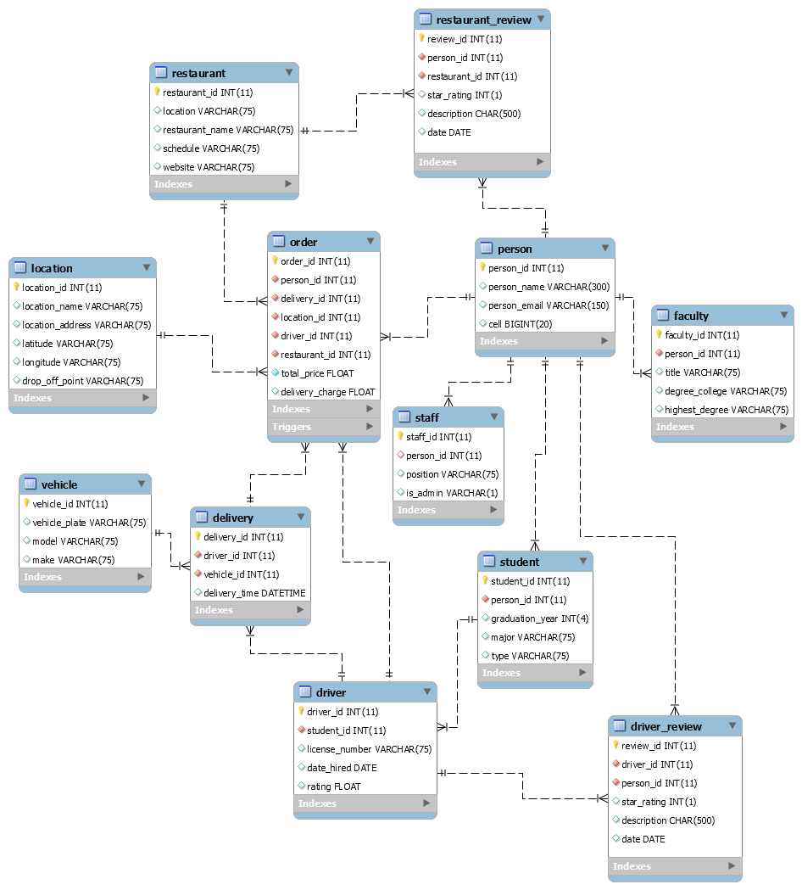

# This repository includes activities for ITCS 3160 - Database-Project-6.

## Group members:
    Sarah Chen,
    Truong Dang,
    Brian King,
    Yuanming Song,
    Aaron Ye
    
##  Introduction: 
### The purpose of this project is to further work upon a database designed by a previous team in order to properly analyze and select data from said database. For the purposes of this project, members of an established group will examine given qualitative and quantitative information on a food delivery service company for UNCC and develop an adequate understanding of the structure of the database by assessing and working upon the provided EERD and SQL database. From the already existing EERD amongst other information provided, essential elements such as business rules, a use case diagram, a data dictionary, along with a normalized EERD must be designed. Group members must also implement a functional rating system for applicable entities within the relational database utilizing proper guidelines on normalization. To fulfill these requirements, appropriate knowledge of SQL must be demonstrated in order to complete specifics including procedure creation, query optimization, and complex query results.

## Index
* [Use Case for Rating System](#Use-Case-for-Rating-System)
* [Business Rules](#Business-Rules)
* [EERD](#EERD)
* [MySQL Queries](#MySQL-Queries)
* [Stored Procedure](#Stored-Procedure)
* [Description of Future Work](#Description-of-Future-Work)
* [MySQL dump](#MySQL-dump)
* [PPT Video](#PPT-Video)

## Use Case for Rating System.jpg)

## Business Rules
* A valid credit/debit card must be available for order confirmation.
* All meals in a single order must be delivered to the same location. 
* All meals in a single order must be paid for using the same payment method.
* User must be at least 21 to order alcoholic beverages
* Minor(18 and under) are not allowed to place orders on this application
* No access from third parties allowed
* Application has the rights to revoke account if false information is detected

## EERD
## MySQL Queries
## Stored Procedure
## Web/App Implementation (Optional) or Description of Future Work
## MySQL dump
## PPT Video (link)
